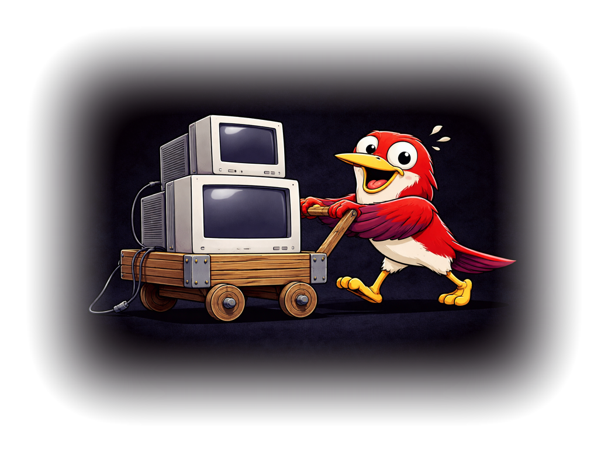

# DeskPad

<p align="center"></p>

You're sharing your screen during a call, but your 5K display makes everything tiny for the audience. Or you want a clean workspace to present from without rearranging your actual desktop. DeskPad gives you a virtual monitor: a real macOS display that lives inside an app window you can share.

## Getting Started

Build and install:

```sh
make install
```

This builds a Release app and copies `DeskPad.app` to `/Applications`. You need Xcode installed.

On first launch, macOS should ask for Screen Recording permission. Grant it in `System Settings -> Privacy & Security -> Screen Recording`, then restart the app if needed.

If macOS already cached an old decision and does not show the prompt again, reset it with:

```sh
tccutil reset ScreenCapture com.stengo.DeskPad
```

## How It Works

Launching DeskPad is like plugging in a second monitor. macOS treats `DeskPad Display` as a real display, so you can move windows to it, set its resolution in `System Settings -> Displays`, and share it in any video call app.

The app window mirrors everything on that virtual display in real time. The mirror window now uses a compact custom title bar with standard macOS window controls, and when your mouse moves onto the virtual display the title bar can switch to one of three indicators:

- `info` for a solid blue state
- `warning` for diagonal yellow and anthracite stripes
- `error` for a pulsing record-style red state

The virtual display starts from your current preferred mode and can be changed later through macOS Displays settings. DeskPad also exposes two refresh-rate presets, `30 Hz` and `60 Hz`.

## Status Bar

DeskPad runs from the menu bar and does not stay in the Dock. Click the display icon in the menu bar to:

- `Hide Window` or `Show Window`
- `Bring Back` to pull the mirror window to the front
- toggle `Always On Top`
- choose `Refresh Rate > 30 Hz / 60 Hz`
- choose `In Use Indicator > info / warning / error`
- `Quit DeskPad`

Hiding the window does not remove the virtual display. Apps can stay on it and screen sharing can keep using it until you quit DeskPad.

## Saved State

DeskPad stores its own settings in `~/.DeskPad/settings.json` and restores them on the next launch when possible. That includes:

- refresh rate
- selected in-use indicator
- preferred virtual display mode
- window position and size
- whether the mirror window is hidden or visible
- whether the window should stay always on top

## Display Snapshot

DeskPad writes the current display layout to `~/.DeskPad/displays.json` and refreshes it whenever screen parameters change. The file includes display IDs, ordering, frames, visible frames, scale factors, and localized names for the active displays.

This is useful for scripts or companion tools that need to react to the current monitor arrangement.

## Troubleshooting

**Black or empty window:** Screen Recording permission is missing, stale, or denied. Re-check it in System Settings and restart DeskPad.

**Prompt does not appear:** macOS may already have a stored TCC decision. Run `tccutil reset ScreenCapture com.stengo.DeskPad`, then launch the app again.

**Window not matching resolution:** change the resolution for `DeskPad Display` in macOS Displays settings. DeskPad will update the mirror window to match and remember the last selected mode.

**Window hidden but display still exists:** that is expected. `Hide Window` removes only the local mirror window; the virtual display stays active until you quit the app.

## Building from Source

```sh
make build
make release
make install
make uninstall
make clean
```

The project runs SwiftFormat from an Xcode build phase during compilation.

## Credits

DeskPad is based on the original project by Bastian Andelefski and contributors:
https://github.com/Stengo/DeskPad

This repository is a maintained fork by Aleks Advaisly with additional work on the compact title bar, menu bar controls, settings persistence, display snapshot publishing, and capture lifecycle behavior.

## License

MIT -- see LICENSE.md.
